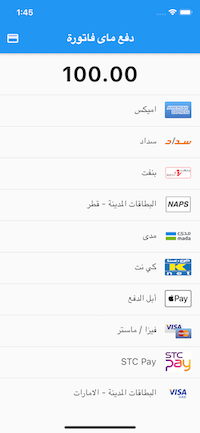
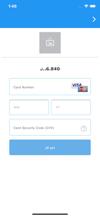

# my_fatoorah

My Fatoorah Payment
# Screenshots
<table>
  <tr>
    <td>Payment methods</td>
     <td>Card inputs</td>
     <td>result</td>
  </tr>
  <tr>
    <td></td>
    <td></td>
    <td></td>
  </tr>
 </table>

## Getting Started

## Installation

```bash
add this to your pubspec.yaml
my_fatoorah: any
```

## Config

### Ios

### add this line to your `Info.plist`

```xml
<key>io.flutter.embedded_views_preview</key>
<true/>
```

### if this url is not using ssl you have to use clear text traffic . put this value in your `manifest` for android

### and allow arbitrary loads in your `Info.plist` for ios

### Android

```xml
 <application
  ...
  android:usesCleartextTraffic="true"
  ...>
  ...
  </application>
```

### Ios

```xml
<key>NSAppTransportSecurity</key>
<dict>
    <key>NSAllowsArbitraryLoads</key>
    <true/>
</dict>
```

## Usage

```dart
import 'package:my_fatoorah/my_fatoorah.dart';
...
 MyFatoorah.startPayment(
                  context: context,
                  request: MyfatoorahRequest(
                      currencyIso: Country.SaudiArabia,
                      successUrl:
                          "Your success call back",
                      errorUrl:
                          "Your error call back",
                      invoiceAmount: 100,
                      language: ApiLanguage.Arabic,
                      token: "Your token here",
                      afterPaymentBehaviour:AfterPaymentBehaviour.None, //See the describe for this property for more details
                      ),
                );

See the example for more details
```
## Another usage way
```dart
import 'package:my_fatoorah/my_fatoorah.dart';
...
 MyFatoorah(
        onResult:(response){
            print(res.status);
        }
        request: MyfatoorahRequest(
                      currencyIso: Country.SaudiArabia,
                      successUrl:
                          "Your success call back",
                      errorUrl:
                          "Your error call back",
                      invoiceAmount: 100,
                      language: ApiLanguage.Arabic,
                      token: "Your token here",
                      afterPaymentBehaviour:AfterPaymentBehaviour.None, //See the describe for this property for more details
                      ),
 );
```


### Notes

- Before version 2.6.7 we handeled test version if you pass token as null
- But we may fatoorah changed thier demo information many times so you have to  pass them
 in MyfatoorahRequest you have to pass url of the test version `https://apitest.myfatoorah.com`
 and token of test version
- you can find demo information here https://myfatoorah.readme.io/docs/demo-information
